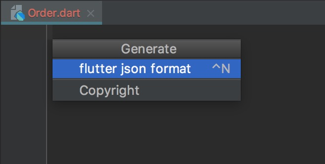
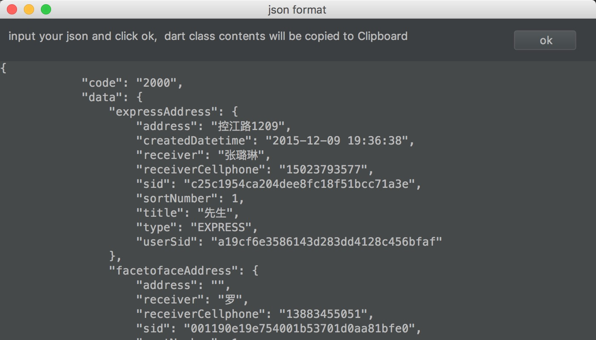
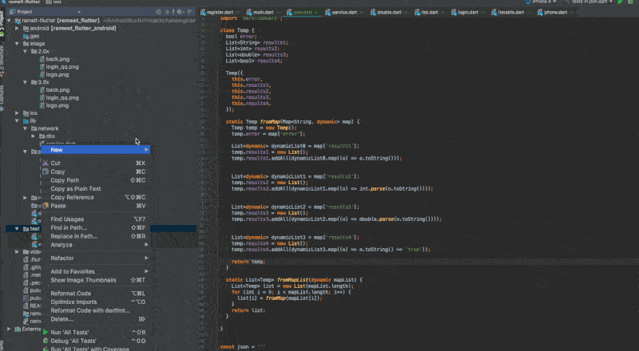

## how to use
#### 1. download jar
https://plugins.jetbrains.com/plugin/11551-dart-json-format


#### 2. install -> install plugin from disk...


#### 3. create a new dart file, then press command + N (mac os)



#### 4. choose "flutter json format", then put your json in

json:

```
{
	"code": "2000",
	"data": {
		"expressAddress": {
			"address": "控江路1209",
			"createdDatetime": "2015-12-09 19:36:38",
			"receiver": "张**",
			"receiverCellphone": "1502379****",
			"sid": "c25c1954ca204dee8fc18f51bcc71a3e",
			"sortNumber": 1,
			"title": "先生",
			"type": "EXPRESS",
			"userSid": "a19cf6e3586143d283dd4128c456bfaf"
		},
		"facetofaceAddress": {
			"address": "",
			"receiver": "罗",
			"receiverCellphone": "1388345****",
			"sid": "001190e19e754001b53701d0aa81bfe0",
			"sortNumber": 1,
			"title": "女士",
			"type": "FACETOFACE",
			"userSid": "a19cf6e3586143d283dd4128c456bfaf"
		},
		"order": {
			"bidding": 2300,
			"brokerAvatar": "broker/getAvatar?key=avatar/b82378ccaccb403c9d8420274372c904",
			"brokerCellphone": "1347282****",
			"brokerDealNum": 15,
			"brokerName": "王**",
			"brokerSid": "b82378ccaccb403c9d8420274372c904",
			"brokerStars": 4.5,
			"code": "1512151307270113",
			"cover": "show/getPoster?key=52f30bbce4ef4122919cbc95c2f01c36/52f30bbce4ef4122919cbc95c2f01c36",
			"createdDatetime": "2015-12-15 13:07:28",
			"deliveryAddressSid": "c25c1954ca204dee8fc18f51bcc71a3e",
			"deliveryFee": 0,
			"evaluateStarts": 0,
			"isDelete": false,
			"isSequential": false,
			"orderStatus": "CLOSED",
			"orderStatusArray": [{
				"operateDatetime": "2015-12-15 13:07:28",
				"operateUserSid": "b82378ccaccb403c9d8420274372c904",
				"operateUsername": "王**",
				"orderSid": "21bc3cc65e9e47af952c1f4f1f0fd85a",
				"orderType": "1",
				"sid": "04940ed81540466ea4408f79989a5d54",
				"state": "TAKING"
			}],
			"orderStatusDesp": "",
			"orderType": "1",
			"payType": "",
			"postTicketSid": "65cc6d54300349e984134ecd0faf3ede",
			"receiveDatetime": "2015-12-15 13:07:28",
			"receiver": "张**",
			"receiverAddress": "控江路1209",
			"receiverCellphone": "1502379****",
			"receiverTitle": "先生",
			"remark": "",
			"requestDatetime": "2015-12-15 13:07:28",
			"showName": "Love Radio 品冠 现在你在哪里 巡回演唱会上海站",
			"showSchedule": "2016-01-09 19:30:00",
			"showScheduleSid": "eecfd0657fb445a7a36abedc9b621c89",
			"showSid": "52f30bbce4ef4122919cbc95c2f01c36",
			"sid": "21bc3cc65e9e47af952c1f4f1f0fd85a",
			"stateDesp": "已关闭",
			"ticketPrice": 88000,
			"ticketQuantity": 1,
			"ticketSid": "c4583aa8a79a478e8e5cd14691028430",
			"totalPrice": 2300,
			"tradeType": "EXPRESS",
			"userCellphone": "1502379****",
			"userLeaveMessage": "",
			"userSid": "a19cf6e3586143d283dd4128c456bfaf",
			"venueAddress": "上海市长宁区武夷路777号",
			"venueName": "上海国际体操中心"
		}
	},
	"extraData": {},
	"message": "",
	"success": true,
    "intList": [0, 1, 2, 3],
    "boolList": [true, false, true, true],
    "doubleList": [0.0, 1.1, 2.2, 3.3]
}
```


#### 5. click "ok", then close plugin, and paste the code to your file

result codes

```
class Temp {
  String code;
  String message;
  bool success;
  DataBean data;
  ExtraDataBean extraData;
  List<bool> boolList;
  List<double> doubleList;
  List<int> intList;

  static Temp fromMap(Map<String, dynamic> map) {
    Temp temp = new Temp();
    temp.code = map['code'];
    temp.message = map['message'];
    temp.success = map['success'];
    temp.data = DataBean.fromMap(map['data']);
    temp.extraData = ExtraDataBean.fromMap(map['extraData']);

    List<dynamic> dynamicList0 = map['boolList'];
    temp.boolList = new List();
    temp.boolList.addAll(dynamicList0.map((o) => o.toString() == 'true'));


    List<dynamic> dynamicList1 = map['doubleList'];
    temp.doubleList = new List();
    temp.doubleList.addAll(dynamicList1.map((o) => double.parse(o.toString())));


    List<dynamic> dynamicList2 = map['intList'];
    temp.intList = new List();
    temp.intList.addAll(dynamicList2.map((o) => int.parse(o.toString())));

    return temp;
  }

  static List<Temp> fromMapList(dynamic mapList) {
    List<Temp> list = new List(mapList.length);
    for (int i = 0; i < mapList.length; i++) {
      list[i] = fromMap(mapList[i]);
    }
    return list;
  }

}

class DataBean {
  ExpressAddressBean expressAddress;
  FacetofaceAddressBean facetofaceAddress;
  OrderBean order;

  static DataBean fromMap(Map<String, dynamic> map) {
    DataBean dataBean = new DataBean();
    dataBean.expressAddress = ExpressAddressBean.fromMap(map['expressAddress']);
    dataBean.facetofaceAddress = FacetofaceAddressBean.fromMap(map['facetofaceAddress']);
    dataBean.order = OrderBean.fromMap(map['order']);
    return dataBean;
  }

  static List<DataBean> fromMapList(dynamic mapList) {
    List<DataBean> list = new List(mapList.length);
    for (int i = 0; i < mapList.length; i++) {
      list[i] = fromMap(mapList[i]);
    }
    return list;
  }
}

class ExtraDataBean {

  static ExtraDataBean fromMap(Map<String, dynamic> map) {
    ExtraDataBean extraDataBean = new ExtraDataBean();
    return extraDataBean;
  }

  static List<ExtraDataBean> fromMapList(dynamic mapList) {
    List<ExtraDataBean> list = new List(mapList.length);
    for (int i = 0; i < mapList.length; i++) {
      list[i] = fromMap(mapList[i]);
    }
    return list;
  }
}

class ExpressAddressBean {
  String address;
  String createdDatetime;
  String receiver;
  String receiverCellphone;
  String sid;
  String title;
  String type;
  String userSid;
  int sortNumber;

  static ExpressAddressBean fromMap(Map<String, dynamic> map) {
    ExpressAddressBean expressAddressBean = new ExpressAddressBean();
    expressAddressBean.address = map['address'];
    expressAddressBean.createdDatetime = map['createdDatetime'];
    expressAddressBean.receiver = map['receiver'];
    expressAddressBean.receiverCellphone = map['receiverCellphone'];
    expressAddressBean.sid = map['sid'];
    expressAddressBean.title = map['title'];
    expressAddressBean.type = map['type'];
    expressAddressBean.userSid = map['userSid'];
    expressAddressBean.sortNumber = map['sortNumber'];
    return expressAddressBean;
  }

  static List<ExpressAddressBean> fromMapList(dynamic mapList) {
    List<ExpressAddressBean> list = new List(mapList.length);
    for (int i = 0; i < mapList.length; i++) {
      list[i] = fromMap(mapList[i]);
    }
    return list;
  }
}

class FacetofaceAddressBean {
  String address;
  String receiver;
  String receiverCellphone;
  String sid;
  String title;
  String type;
  String userSid;
  int sortNumber;

  static FacetofaceAddressBean fromMap(Map<String, dynamic> map) {
    FacetofaceAddressBean facetofaceAddressBean = new FacetofaceAddressBean();
    facetofaceAddressBean.address = map['address'];
    facetofaceAddressBean.receiver = map['receiver'];
    facetofaceAddressBean.receiverCellphone = map['receiverCellphone'];
    facetofaceAddressBean.sid = map['sid'];
    facetofaceAddressBean.title = map['title'];
    facetofaceAddressBean.type = map['type'];
    facetofaceAddressBean.userSid = map['userSid'];
    facetofaceAddressBean.sortNumber = map['sortNumber'];
    return facetofaceAddressBean;
  }

  static List<FacetofaceAddressBean> fromMapList(dynamic mapList) {
    List<FacetofaceAddressBean> list = new List(mapList.length);
    for (int i = 0; i < mapList.length; i++) {
      list[i] = fromMap(mapList[i]);
    }
    return list;
  }
}

class OrderBean {
  String brokerAvatar;
  String brokerCellphone;
  String brokerName;
  String brokerSid;
  String code;
  String cover;
  String createdDatetime;
  String deliveryAddressSid;
  String orderStatus;
  String orderStatusDesp;
  String orderType;
  String payType;
  String postTicketSid;
  String receiveDatetime;
  String receiver;
  String receiverAddress;
  String receiverCellphone;
  String receiverTitle;
  String remark;
  String requestDatetime;
  String showName;
  String showSchedule;
  String showScheduleSid;
  String showSid;
  String sid;
  String stateDesp;
  String ticketSid;
  String tradeType;
  String userCellphone;
  String userLeaveMessage;
  String userSid;
  String venueAddress;
  String venueName;
  bool isDelete;
  bool isSequential;
  double brokerStars;
  int bidding;
  int brokerDealNum;
  int deliveryFee;
  int evaluateStarts;
  int ticketPrice;
  int ticketQuantity;
  int totalPrice;
  List<OrderStatusArrayListBean> orderStatusArray;

  static OrderBean fromMap(Map<String, dynamic> map) {
    OrderBean orderBean = new OrderBean();
    orderBean.brokerAvatar = map['brokerAvatar'];
    orderBean.brokerCellphone = map['brokerCellphone'];
    orderBean.brokerName = map['brokerName'];
    orderBean.brokerSid = map['brokerSid'];
    orderBean.code = map['code'];
    orderBean.cover = map['cover'];
    orderBean.createdDatetime = map['createdDatetime'];
    orderBean.deliveryAddressSid = map['deliveryAddressSid'];
    orderBean.orderStatus = map['orderStatus'];
    orderBean.orderStatusDesp = map['orderStatusDesp'];
    orderBean.orderType = map['orderType'];
    orderBean.payType = map['payType'];
    orderBean.postTicketSid = map['postTicketSid'];
    orderBean.receiveDatetime = map['receiveDatetime'];
    orderBean.receiver = map['receiver'];
    orderBean.receiverAddress = map['receiverAddress'];
    orderBean.receiverCellphone = map['receiverCellphone'];
    orderBean.receiverTitle = map['receiverTitle'];
    orderBean.remark = map['remark'];
    orderBean.requestDatetime = map['requestDatetime'];
    orderBean.showName = map['showName'];
    orderBean.showSchedule = map['showSchedule'];
    orderBean.showScheduleSid = map['showScheduleSid'];
    orderBean.showSid = map['showSid'];
    orderBean.sid = map['sid'];
    orderBean.stateDesp = map['stateDesp'];
    orderBean.ticketSid = map['ticketSid'];
    orderBean.tradeType = map['tradeType'];
    orderBean.userCellphone = map['userCellphone'];
    orderBean.userLeaveMessage = map['userLeaveMessage'];
    orderBean.userSid = map['userSid'];
    orderBean.venueAddress = map['venueAddress'];
    orderBean.venueName = map['venueName'];
    orderBean.isDelete = map['isDelete'];
    orderBean.isSequential = map['isSequential'];
    orderBean.brokerStars = map['brokerStars'];
    orderBean.bidding = map['bidding'];
    orderBean.brokerDealNum = map['brokerDealNum'];
    orderBean.deliveryFee = map['deliveryFee'];
    orderBean.evaluateStarts = map['evaluateStarts'];
    orderBean.ticketPrice = map['ticketPrice'];
    orderBean.ticketQuantity = map['ticketQuantity'];
    orderBean.totalPrice = map['totalPrice'];
    orderBean.orderStatusArray = OrderStatusArrayListBean.fromMapList(map['orderStatusArray']);
    return orderBean;
  }

  static List<OrderBean> fromMapList(dynamic mapList) {
    List<OrderBean> list = new List(mapList.length);
    for (int i = 0; i < mapList.length; i++) {
      list[i] = fromMap(mapList[i]);
    }
    return list;
  }
}

class OrderStatusArrayListBean {
  String operateDatetime;
  String operateUserSid;
  String operateUsername;
  String orderSid;
  String orderType;
  String sid;
  String state;

  static OrderStatusArrayListBean fromMap(Map<String, dynamic> map) {
    OrderStatusArrayListBean orderStatusArrayListBean = new OrderStatusArrayListBean();
    orderStatusArrayListBean.operateDatetime = map['operateDatetime'];
    orderStatusArrayListBean.operateUserSid = map['operateUserSid'];
    orderStatusArrayListBean.operateUsername = map['operateUsername'];
    orderStatusArrayListBean.orderSid = map['orderSid'];
    orderStatusArrayListBean.orderType = map['orderType'];
    orderStatusArrayListBean.sid = map['sid'];
    orderStatusArrayListBean.state = map['state'];
    return orderStatusArrayListBean;
  }

  static List<OrderStatusArrayListBean> fromMapList(dynamic mapList) {
    List<OrderStatusArrayListBean> list = new List(mapList.length);
    for (int i = 0; i < mapList.length; i++) {
      list[i] = fromMap(mapList[i]);
    }
    return list;
  }
}
```


#### 6. use classes in code

```
main() {
  var map = new JsonDecoder().convert(json);
  Temp temp = Temp.fromMap(map);
  print(temp.data.expressAddress.address);
}
```

it prints:

```
控江路1209
```

#### 7. gif



